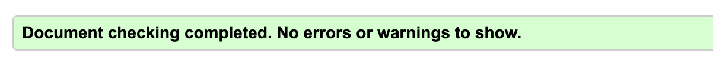

# Quizzing

## Introduction

This site was created 

Link to the live site here - [Quizzing]()

## Table of Contents:
1. [**Introduction**](#introduction)
1. [**Design**](#Design)
    * [***Target audience***](#target-audience)
    * [***User Stories***](#user-stories)
    * [***Site aims***](#site-aims)
    * [***Color scheme***](#color-scheme)
    * [***Typography***](#typography)
1. [**Features**](#Features)
    * [***Navigation bar***](#navigation-bar)
    * [***Hero image***](#hero-image)
    * [***My mission***](#my-mission-section)
    * [***About me***](#about-me-section)
    * [***Footer***](#the-footer)
    * [***Services***](#services)
    * [***Contact***](#contact)
    * [***Contact feedback***](#contact-feedback)
    * [***Future features***](#future-features)
1. [**Testing**](#testing)
    * [***Manual testing***](#manual-testing)
    * [***Validator testing***](#validator-testing)
    * [***Lighthouse testing***](#lighthouse-testing)
       * [*Home page*](#home-page)
       * [*Services page*](#services-page)
       * [*Contact page*](#contact-page)
       * [*Contact feedback page*](#contact-feedback-page)
    * [***Wave accessibility evaluation***](#wave-accessibility-evaluation)
1. [**Deployment**](#deployment)
1. [**Bugs**](#bugs)
    * [***Fixed Bugs***](#fixed-bugs)
    * [***Unfixed Bugs***](#unfixed-bugs)
1. [**Credits**](#credits)
    * [***Code***](#code)
    * [***Content***](#content)
    * [***Media***](#media)
    * [***General reference***](#general-reference)

## Design

### Target audience 
* Women who need a change in their lives.
* Women who are drawn to spirituality and alternative medicine/practices.
* Women who are looking for a mentor and community.
* Women who have tried going the 'normal' route (doctors and therapists) but are now searching for other ways of healing.

### User stories
* I want to see and understand what the subject of the site is.
* I want to easily navigate the site.
* I want to learn more about the subject as I go through the page to make a judgment if this is for me.
* I want to see what products/services are available to me.
* I want to be able to connect for further information.

### Site aims 
* To showcase the client Denice Hedstrom as a professional working with healing.
* To be simple and straightforward enough to keep users on the page wanting to learn more.
* To manifest the clients meant to work with Denice by creating a site that reflects Denice's energy.
* To provide a way for users to reach out to Denice.

### Color scheme
The client had requested pastel shades of gold/yellow and a simple website so I went with the below colors of gold/yellow and brown for the site and black/dark brown for texts. 
I utilized the Contrast grid by Eightshapes to test my color combos so the colors complied with the highest accessibility.

### Typography
I used two different fonts across the page:
 * Bodoni Moda, which was the main one used for most content.
 * Montserrat, is used for a text in the footer.

I wanted to keep it simple and with the different font-weights, heading styles and sizes, Bodoni Moda was enough to give the texts a variation.

The fonts were sourced from Google Fonts.

## Features 

### Navigation Bar

  - The navigation bar can be seen on all three main pages, as well as on the fourth contact form feedback page. 
  - It features fully functional and tested links:
    * The title with a link to the home page
    * Home page link
    * Services page link
    * Contact page link
    * Social media links (to give the user easier access than having to scroll down to the footer).
  - For mobile, it features a toggle button in the shape of a 'burger' (three horizontal lines icon) that is fully responsive when clicked, exposing and/or hiding the navigation bar. 
  - This feature is crucial for easy navigation on the page and to highlight the different sections available to the user.

  

### Hero image

- The hero image section consists of an image of Denice during a retreat banging on a shamanic drum she calls Luna. It's meant to immediately capture the user with the harmonious energy felt from Denice in the midst of her work, as well as to display what kind of site the user has entered.
- It also consists of two text overlays that explain the purpose of the work Denice does, making it easier to catch the eye of the people who are there for 'Abundance. Purpose. Freedom' and who want to 'activate their potential'.
- The first text has a dark brown color with an opacity to make it softer and blend into the background better.
- The second text is enveloped in a color that matches the image and color scheme and the text is white, all to display it as a separate text and catch the eye of the user.

### My Mission section

- This section's aim is very straightforward I would say, to give a brief statement of what Denice's 'mission' is with her work and what she aims to achieve with every client in her space.
- This will also catch the eye of the people who resonate with the work she does and how she expresses herself.
- It features an image of her praying with a feather (which is an item she works a lot with for healings).
- I wanted this section very simple to focus the attention on her mission and the image which complements the feeling of the section.

### About Me section

- This section is also very self-explanatory, it shares a brief story about Denice's life and her passion for her work, which is very important for a more personal feel to the site and to invite users to get a deeper understanding of Denice.
- It features a more portrait-style picture of Denice, perfectly fitting the more personal section.
- I added the horizontal lines next to the image to fill out the space and give some more dimension to the section, as well as to complement it to the borders (heading border, border-bottom in text) visible on the page.

### Footer

- The footer is very much in line with the theme of the site and it allows users to access a free meditation by Denice. 
- It features a short encouraging text and a fully functional button that takes users to a Google Drive link with a free meditation.
- This is a great way to give users a preview of Denice's work and allow them to connect with her indirectly which can help them decide if they feel safe doing healing work with her.
- The footer also consists of fully functional social media links with a short text letting users know there is more magical content to be found.

### Services

- This page highlights her 'offerings' and their prices, these are the different programs or services she has available to clients. There is also a fully functional button to contact her for more information, which takes the user to the Contact page.
- It also features an image of the regular tools she uses for her sessions, which flows very well with the content of the page.
- This page is, of course, very crucial to showcase her different services and allow users to contact her to start working together if they feel drawn to her services.

, a subject, a message (with longer text input) and a fully functioning 'submit' button.
- Every input needs to be filled in, otherwise, the user receives a message saying 'Please fill in this field'. This was achieved by adding 'Required' to every input.
- There is also an image alongside the form that shows Denice smiling and giving thanks, which fits the theme of the page (she's thanking users for contacting her).
- This page is very important to allow users to be able to contact Denice and for Denice to be able to sign new clients up.

### Contact feedback

- This is the page the users are taken to when they press the 'submit' button on the contact form. It has a cute little 'thank you' note with a quote to be a little bit less formal and send some good energy to the users.
- It has all the same features as the other pages so the user can continue scrolling on the site if they wish.
- This page improves user experience and it gives off a good energy, which is very important for a site for a healer.

### Future features

__My mission section__
- For larger screens, I would use Flexbox and move the first paragraph to the left and the one under it to the right and so on. To take up some more space and give it a new look. 

__About me section__
- For larger screens, I would use Flexbox and move a part of the text next to the image to fill up some more space and create a more even layout.

__Services page__
- I would add more content to explain what the different offerings entail and give them all a separate section on the page. For a bigger project, I would create a separate page for each offering and have buttons linking to Denice's Calendly instead for direct booking.

__Contact page__
- I would create a real contact form (since this one is a mock one) with the 'POST' method.
- I would change the background to an image to make the page look a bit more playful, it looks a bit simple at the moment.

__Thank you page__
- I would add a link to one of Denice's YouTube videos for more free content and exposure to Denice's work.

## Testing 

### Manual testing
I manually tested this site in multiple ways highlighted below:
* Tested every feature and its responsiveness through a preview browser in CodeAnywhere, as well as through an extension of a live server in VScode.
* Deployed the site in an early stage and received feedback from a professional developer (mentor), as well as students in my community.
* Tested the site for cross-compatibility in the two most used browsers, Chrome and Safari.
* I used DevTools to easily move between different screen sizes, simulating sizes between 320px to 4000px.

### Validator Testing 
I tested all the pages in the validators to make sure they all passed.
- HTML
  - There were no errors present when passing through the official W3C validator 

- CSS
  - There were no errors present when passing through the official Jigsaw validator 

### Lighthouse testing 

This testing was done in an incognito window in Chrome to make sure the results were not influenced by browser extensions.

The main issue I encountered on every page (both mobile and desktop) was the size of the images and after reducing the sizes, all pages except the home page achieved over 90 performance.

#### Home page
__Mobile version:__
I encountered troubles on this page with the mobile testing due to images being too large and that there was no width on the images in the sections (only height).
- I resized the images probably over five times to get them as small as I could without impacting the quality too much (images are now all under 200KB which is the most I can do without affecting the quality too much) but Lighthouse still flagged my LCP as too high for the Hero image.
- I added a fitting width to the height of the images but Lighthouse then flagged that the images should be their original width and height instead and it was not allowing me to design the images smaller to fit the style of the site. 

All in all, I'm happy with being above 80 for mobile screens after trying to fix the issues multiple times.

__After speaking with fellow students about the Lighthouse testing, it seems multiple others encountered similar problems as me with the mobile testing. Even after reducing images, they still received the same performance scores under 80__

__Desktop version:__

#### Services page
__Mobile version:__

__Desktop version:__

#### Contact page
__Mobile version:__

__Desktop version:__

#### Contact feedback page
__Mobile version:__

__Desktop version:__

### Wave accessibility evaluation

I also used the Wave evaluation tool to make sure I covered all my bases. 
Two issues popped up (which are also highlighted in the Bugs section):
- Toggle down button flagged that there was no corresponding accessibility text to the label.
   * This was sorted with the assistance of my mentor by adding a span tag inside the label tag and adding an accessibility text. I then added a class to the span opening tag and set it to 'Display: none'. It was also necessary to add 'Aria-hidden="False"' to the opening tag to expose the text to assistive technology.

- The access to the home page through the title didn't work and the a link flagged the same issue as the toggle button (no accessibility text).
   * I realized I had not added the title h1 inside the a tag, it was directly below it and so they were not linked. After adding the h1 inside the a tag, the issue was resolved.

The evaluation is now free from errors and below is taken from the Home page but the results match on all pages.

## Deployment

To deploy the site to GitHub pages, I went through below steps: 
- Go to the Settings tab of the project's Github repository.
- There is a General menu on the left side of the screen, go to Code & Automation and click Pages.
- Scroll down to the Build & Deployment section and choose the Source 'Deploy from a branch'.
- Below this, you choose the Branch 'Main' and the Folder '/root'.
- Press Save and go back to the Code page of your repository.
- After a couple of minutes, refresh the page and the successfully deployed site will be found on the right-hand side of the page under 'Deployments' with the name "GitHub pages".

Live link to the site - [Quizzing]()

### Cloning

### Forking

## Bugs

### Fixed Bugs
1. **Issue**
    * The 'checkAnswer' function is not running when clicking answers.
* **Fix**
    * Added 'checkAnswer(this)' in the 'onclick' HTML element.

2. **Issue**
    * 
* **Fix**
    * 

3. **Issue**
    * 
* **Fix**
    * 

4. **Issue**
    * 
* **Fix**
    * 

5. **Issue**
    * 
* **Fix**
    * 

6. **Issue**
    * 
* **Fix**
    * 

### Unfixed Bugs

No unfixed bugs.

## Credits 

### Code 

_Code Institute's Love Maths Project credit_
- The navigation toggle button.
- Use the Main section to push the footer down.

_External pages credit_
- I drew help from [Codehal YouTube](https://www.youtube.com/watch?v=Vp8x8-reqZA&ab_channel=Codehal) for JavaScript. Some code is 
- The lines on either side of the image in the About Me section were drawn from [Daniel Vassallo's comment on StackOverflow](https://stackoverflow.com/questions/3148415/how-to-make-a-vertical-line-in-html#:~:text=You%20can%20draw%20a%20vertical,width%20with%20any%20html%20element.&text=The%20width%20property%20determines%20the,the%20color%20of%20the%20line.).

### Content 

- The texts for the home page were provided by the client Denice Hedstrom.
- The offerings on the services page were provided by Denice Hedstrom.
- The social media links were provided by Denice Hedstrom and link to her real Instagram page and Youtube channel.
- The contact form is a mock form that opens a fourth page with a thank you note.
- The icons in the footer/navigation bar were taken from [Font Awesome](https://fontawesome.com/)
- The meditation link in the footer was shared by Denice Hedstrom.

### Media

- The images used on the home page, services page and contact page were provided by Denice Hedstrom.
- [RedKetchup](https://redketchup.io/image-resizer) was used to resize images.
- Fonts were acquired from [Google Fonts](https://fonts.google.com/).
- Social media icons were acquired from [Font Awesome](https://fontawesome.com/).
- [Am I Responsive](https://ui.dev/amiresponsive) was used to generate the initial image of the ReadME to showcase how the site looks on different screens.

### General reference

- I relied upon my code learnings from the Code Institute, as well as the walk-through of the Love Running project. There can be some similarities in the code but I credited the sections where the code didn't deviate fully.
- W3Schools and StackOverflow were the ones mostly used for external references, offering much-needed explanations and inspiration. 