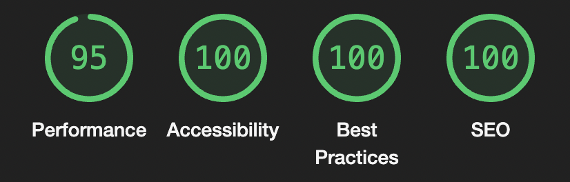
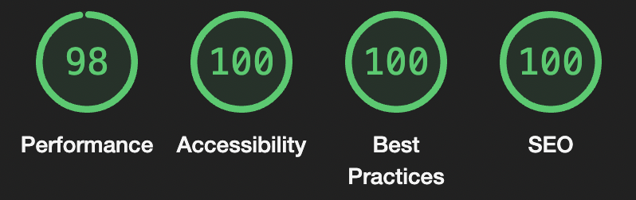

# Quizzing

## Introduction

Quizzing is a simple and fun quiz page that aims to test your general knowledge skills with questions ranging from geography to entertainment and everything in between.

It's for those moments when you want to challenge your friends and see who really listened during class or for the crazy game nights at home with your family to actually test if your dad is as smart as he says he is.

Quizzing also aims to challenge the different website quizzes out there that have a tendency to look a bit..... boring. 

I love quiz sites but I don't feel particularly excited to answer a bunch of questions on a site that looks like it belongs to an accountant, you know?!

Link to the live site here - [Quizzing](https://mayamariaruth.github.io/quizzing/quiz.html)

## Table of Contents:
1. [**Introduction**](#introduction)
1. [**Design**](#Design)
    * [***Target audience***](#target-audience)
    * [***User Stories***](#user-stories)
    * [***Site aims***](#site-aims)
    * [***Color scheme***](#color-scheme)
    * [***Typography***](#typography)
1. [**Features**](#Features)
    * [***Header***](#header)
    * [***Home page***](#home-page)
    * [***Quiz***](#quiz)
    * [***End of quiz popup***](#end-of-quiz-popup)
    * [***Footer***](#the-footer)
1. [**Testing**](#testing)
    * [***Manual testing***](#manual-testing)
    * [***Validator testing***](#validator-testing)
    * [***JSHint testing***](#jshint-testing)
    * [***Lighthouse testing***](#lighthouse-testing)
       * [*Home front page*](#home-front-page)
        * [*Quiz area*](#quiz-area)
    * [***Wave accessibility evaluation***](#wave-accessibility-evaluation)
1. [**Deployment**](#deployment)
    * [***Cloning***](#cloning)
1. [**Bugs**](#bugs)
    * [***Fixed Bugs***](#fixed-bugs)
    * [***Unfixed Bugs***](#unfixed-bugs)
1. [**Credits**](#credits)
    * [***Code***](#code)
    * [***Content***](#content)
    * [***Media***](#media)
    * [***General reference***](#general-reference)

## Design

### Target audience 
* People of all ages, quizzes are for everyone!
* People who enjoy quizzes and answering questions about different topics.
* People who like an intellectual challenge.
* People who like to play games and test their knowledge, as well as learn new things.
* People who are looking for a more visually pleasing quiz site.

### User stories
* I want to see and understand what the subject of the site is immediately.
* I want to easily navigate the site if needed.
* I want to be tested on my general knowledge skills.
* I want to feel happy from the look and feel of the site, ready to embark on the quiz challenge.

### Site aims 
* To spread some happiness with the design of the site and challenging questions.
* To bring people together and start quizzing!
* To teach some general knowledge.
* To activate the user's brain and get them excited about general knowledge.
* To challenge website quizzes that are not so visually appealing.

### Color scheme
I adapted the colors on the site to my main image so it would look more cohesive.
I generated the colors from the image on [Coolors](https://coolors.co/) so the background image would match the image and the questions color/quiz buttons color would match the pattern on the image.

I utilized the Contrast grid by Eightshapes to test my color combos so the colors complied with the highest accessibility.

I did not add the green and red text to the answer options after the user has selected an answer (I just added a thick green/red border) since they did not pass on the '#EF7A16' background as seen below.

### Typography
I used two different fonts across the page:
 * Rubik Doodle Shadow, used for the logo.
 * Lato, used for the quiz text.

I wanted a fun font for the logo so it would match the playful vibe of a quiz site so Rubik Doodle Shadow was perfect for that.
Lato is a very nice standard-looking font so it was a perfect mix of fun/serious, which I think makes sense for a General Knowledge quiz.

The fonts were sourced from Google Fonts.

## Features 

### Header
  - The header consists of a simple logo with a quirky font to immediately display to the user that this is a site for fun!
  - The logo is also a link to the home page, to enable easy navigation.

  

### Home page
- The home page has a simple and aesthetically pleasing design with a cool background image generated with AI. The background color blends well with the image so it fits larger screens without ruining the content.
- The colors (yellow, orange) are colors that are considered 'happy' colors so it was very intentional to go for those.
- There is a short text that references the site name in a fun way and a start quiz button that has a hover effect with a hard border-shadow to match the quirky-ness.

### Quiz
- The quiz area consists of a box with questions, answers, a score counter and a button to exit (to the home page) and a button to move to the next question (which is disabled until the user selects an option).
- The colors of the buttons and questions are generated from the background image to match and the orange color gives it a more playful vibe.
- There is a hover effect on the answer options and buttons so the user always knows where their mouse is.
- If the user has selected an incorrect answer, they will not see what the correct answer is which is a common feature on some quiz sites. I decided not to do so to help keep the user on the site after completing the quiz and wanting to play the quiz more times to get a higher score.

### End of quiz popup
- This is a very simple popup with a 'Well done' message and the user's total score.
- It is the same design as the quiz area to stay on the same theme and it also consists of the exit button (to the home page) and a try again button (to the start of the quiz).

### Footer
- The footer consists of social media icons with links to the home pages of the social websites.
- I wanted to keep this very simple and allow more focus on the quiz area.

### Future features
- Disable the Next button until the user has selected an answer.
- Add different quizzes focused on various subjects, such as a Science quiz, History quiz and so on.
- Add a navigation bar to choose between the different quizzes to play.
- Add up to 50 questions to make the quiz longer and keep users on the site.
- Add a feature to allow users to send the quiz to their friends and create 'rooms' to keep track of everyone's score (It's always more fun to play with friends!).

## Testing 

### Manual testing
I manually tested this site in multiple ways highlighted below:
* Tested every feature and its responsiveness through an extension of a live server in VScode.
* Deployed the site in an early stage and received feedback from a professional developer (mentor), as well as students in my community.
* Tested the site for cross-compatibility in the two most used browsers, Chrome and Safari.
* I used DevTools to easily move between different screen sizes, simulating sizes between 320px to 4000px (but it is also functional on even larger screens given the max-width setting on the Body element to keep the content compact instead of stretched).

### Validator Testing 
I tested all the pages in the validators to make sure they all passed.
- HTML
  - There were no errors present when passing through the official W3C validator 

- CSS
  - There were no errors present when passing through the official Jigsaw validator 

### JSHint testing
There were no warnings with the JSHint testing after successfully sorting out the bugs highlighted in the [Bugs section](#bugs).

  

### Lighthouse testing 

This testing was done in an incognito window in Chrome to make sure the results were not influenced by browser extensions.

The desktop testing was the same score for the home page and quiz page but the mobile testing differed by just a couple of points but both pages scored incredibly well.

At first, the mobile testing was in the high 80s score but after compressing the background image, the scores went up into the 90s range.

__Desktop version:__

#### Home front page 
__Mobile version:__

#### Quiz area

__Mobile version:__

### Wave accessibility evaluation

I also used the Wave evaluation tool to make sure I covered all my bases. 

The evaluation is free from errors and below is taken from the Home page and quiz page.

#### Wave home page

#### Wave quiz page

## Deployment

To deploy the site to GitHub pages, I went through below steps: 
- Go to the Settings tab of the project's GitHub repository.
- There is a General menu on the left side of the screen, go to Code & Automation and click Pages.
- Scroll down to the Build & Deployment section and choose the Source 'Deploy from a branch'.
- Below this, you choose the Branch 'Main' and the Folder '/root'.
- Press Save and go back to the Code page of your repository.
- After a couple of minutes, refresh the page and the successfully deployed site will be found on the right-hand side of the page under 'Deployments' with the name "GitHub pages".

Live link to the site - [Quizzing](https://mayamariaruth.github.io/quizzing/quiz.html)

### Cloning

I used the cloning method to use the VSCode desktop IDE with GitHub, below are the steps I took:
- Generate a repository and click the Code button in the middle of the screen.
- Go to Local and under Clone, copy the Git repository URL on the HTTPS tab.
- Go to the VSCode IDE front page and click 'Clone Git Repository' under Start or go to the Source Control button on the left-hand side menu bar and click 'Clone Repository'.
- Input the URL in the URL tab at the top of the window and press Enter.
- Select the location/folder where you want to store your repository on your computer through the popup and click the 'Select Repository location' button.
- VSCode will now clone the repository and you can choose to open it in your current window or in a new window.

## Bugs

### Fixed Bugs
1. **Issue**
    * 'showQuestions' function kept getting an error that '.question' was not defined when pressing the Next button at the end of the quiz.
* **Fix**
    * I added the 'finishQuiz' function and it was then sorted.

2. **Issue**
    * 'finishQuiz' function was not registering the Display style settings so the end of quiz popup was not popping up after the quiz was over.
* **Fix**
    * I changed the class tag to an ID tag on the HTML elements.

3. **Issue**
    * The score was not showing up at the end of the quiz popup.
* **Fix**
    * I added a new ID tag to the element and a variable 'totalScore' and its textContent equaled the scoreSum in the 'finishQuiz' function.

4. **Issue**
    * When clicking the Next button, the class tags to disable the answer buttons and to add color to the correct/incorrect answers doesn't reset.
* **Fix**
    * I added an eventListener function for the answer options buttons and enabled the buttons in a For loop inside the Next button function.

5. **Issue**
    * Warning in JSHint: "Functions declared within loops referencing an outer scoped variable may lead to confusing semantics. (checkAnswer)" 
* **Fix**
    * I changed the For loop inside the eventListener to the forEach method.

6. **Issue**
    * The forEach method in the eventListener function was sending an error back in the console that it wasn't a function so it wasn't executing.
* **Fix**
    * I needed to convert the answer options buttons (choiceButtonRef) to an array using the Array.from() method.

7. **Issue**
    * The 10th question was not displaying before the end of quiz popup shows up.
* **Fix**
    * I changed the '(questionNumber === questions.length)' If statement in the nextBtn.onclick function to (questionCount === questions.length) instead.

### Unfixed Bugs

No unfixed bugs.

## Credits 

### Code 

_External pages credit_
- I drew help from [Codehal YouTube](https://www.youtube.com/watch?v=Vp8x8-reqZA&ab_channel=Codehal) for the code found in the 'checkAnswer' function.

### Content 

- The questions and answers were generated with ChatGPT.
- The social media links directly to the home pages of each site.
- Fonts were acquired from [Google Fonts](https://fonts.google.com/).
- The icons in the footer were taken from [Font Awesome](https://fontawesome.com/).

### Media

- The background image was generated with Microsoft Designer's AI tool.
- The color palette was generated with the image on [Coolors](https://coolors.co/).
- [Am I Responsive](https://ui.dev/amiresponsive) was used to generate the initial image of the ReadME to showcase how the site looks on different screens.

### General reference

- I relied upon my code learnings from the Code Institute, as well as the walk-through of the Love Maths project and [Codehal's YouTube video](https://www.youtube.com/watch?v=Vp8x8-reqZA&ab_channel=Codehal). There are similarities in some of the code but I credited the necessary sections.
- W3Schools and StackOverflow were the sites mostly used for external references.